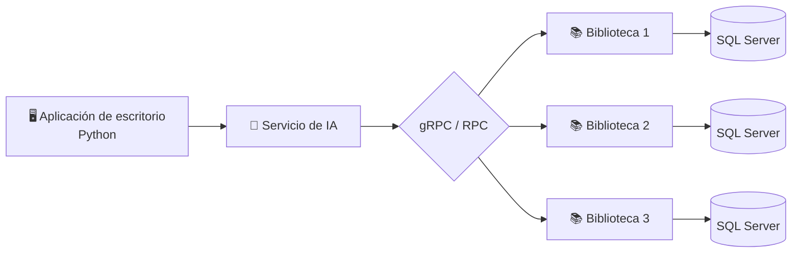

<div align="center">

# 📚 Sistema Distribuido de Consulta Inteligente de Libros

**Gestión bibliotecaria distribuida en tres nodos con consultas en lenguaje natural mediante IA**


*Universidad Manuela Beltrán · Ingeniería de Software · 7° Semestre*

</div>

---

## 📖 Descripción

Aplicación de escritorio desarrollada en **Python** para gestionar libros, usuarios, préstamos y devoluciones en **tres bibliotecas independientes**. Cada biblioteca funciona como un nodo autónomo con su propia base de datos **SQL Server**, y los nodos se comunican mediante **gRPC/RPC**. Incluye un **módulo de Inteligencia Artificial** que permite consultar la disponibilidad de libros usando lenguaje natural, respondiendo solo con datos reales obtenidos de las bases de datos.

## 🎯 Problema

Buscar libros en varias bibliotecas puede ser lento e ineficiente, y no existe una forma sencilla de consultar la disponibilidad en tiempo real. Esto dificulta la experiencia de los usuarios y hace compleja la gestión manual de las bibliotecas.

## 🚀 Objetivos

**General:** Desarrollar un sistema distribuido de escritorio que gestione los recursos de tres bibliotecas y use IA para facilitar la búsqueda de libros mediante preguntas en lenguaje natural.

**Específicos:**
- Implementar la gestión de libros, usuarios, préstamos y devoluciones.
- Desarrollar la comunicación entre nodos mediante gRPC/RPC.
- Integrar un módulo de IA para consultas en lenguaje natural.
- Garantizar la integridad de la información con transacciones y propiedades ACID.

## ✨ Funcionalidades

| Módulo | Descripción |
|--------|-------------|
| 📘 **Gestión bibliotecaria** | CRUD de libros, usuarios, préstamos y devoluciones |
| 🤖 **Consultas con IA** | Preguntas en lenguaje natural sobre las tres bibliotecas |
| 🔄 **Sincronización** | Intercambio de información entre nodos en tiempo real |
| 📊 **Disponibilidad y reportes** | Control de inventario y generación de reportes |
| 🔒 **Transacciones** | Préstamos y devoluciones con garantías ACID |

## 🏗️ Arquitectura



- **Nodos independientes:** cada biblioteca gestiona su propio inventario, usuarios, préstamos y disponibilidad.
- **Comunicación:** gRPC/RPC, un protocolo eficiente y seguro entre servicios.
- **Persistencia:** una base de datos SQL Server por nodo.

## 🔐 Operaciones CRUD y propiedades ACID

| CRUD | | ACID | |
|------|---|------|---|
| **Create** | Registrar libros, usuarios y préstamos | **Atomicidad** | Todo o nada |
| **Read** | Consultar libros, usuarios y disponibilidad | **Consistencia** | Mantiene la validez de los datos |
| **Update** | Modificar información y disponibilidad | **Aislamiento** | Evita interferencias entre transacciones |
| **Delete** | Eliminar o desactivar registros | **Durabilidad** | Asegura los cambios |

## 🛠️ Tecnologías

- **Lenguaje:** Python
- **Interfaz gráfica:** Tkinter / PyQt
- **Comunicación:** gRPC / RPC
- **Base de datos:** SQL Server
- **IA:** Módulo de procesamiento de lenguaje natural en Python
- **IDE:** Visual Studio Code / PyCharm

## 👥 Usuarios del sistema

- **Administradores:** configuración y control general del sistema.
- **Bibliotecarios:** gestión de inventario, préstamos y devoluciones.
- **Usuarios:** estudiantes y público en general que consultan libros.

## ⚙️ Instalación

```bash
# Clonar el repositorio
git clone https://github.com/<usuario>/<repositorio>.git
cd <repositorio>

# Crear y activar entorno virtual
python -m venv venv
source venv/bin/activate      # Windows: venv\Scripts\activate

# Instalar dependencias
pip install -r requirements.txt
```

## ▶️ Ejecución

```bash
# 1. Iniciar los nodos de cada biblioteca
python servidor.py --nodo 1
python servidor.py --nodo 2
python servidor.py --nodo 3

# 2. Iniciar la aplicación de escritorio
python main.py
```

> ⚠️ Configura la cadena de conexión de cada instancia de SQL Server en el archivo de configuración antes de ejecutar.

## 📌 Resultado esperado

Un sistema funcional, distribuido y seguro que permita gestionar tres bibliotecas y realizar consultas inteligentes de libros en lenguaje natural.

## 🎓 Información académica

| Universidad | Programa | Nivel | Modalidad |
|-------------|----------|-------|-----------|
| Universidad Manuela Beltrán | Ingeniería de Software | 7° Semestre | Presencial |

## 👨‍💻 Autores

- **Nombre del autor** – [@Felipe Villaquiran](https://github.com/pipeeex)
- [@Alejandro Mier](https://github.com/Cachureto)
- [@Gabriel Badillo](https://github.com/gabrielbadillo)

---

<div align="center">
<sub>Desarrollado con 💙 en Python · Universidad Manuela Beltrán</sub>
</div>
